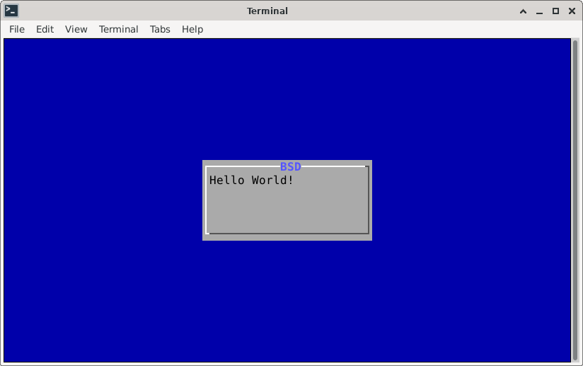

# BSDDialog

**Work In Progress!**

This project provides **bsddialog** and **libbsddialog**, an utility and a
library to build scripts and tools with *TUI Widgets*.

Description:
<https://www.freebsd.org/status/report-2021-04-2021-06/#_bsddialog_tui_widgets>


## Getting Started

FreeBSD:

```
% git clone https://gitlab.com/alfix/bsddialog.git
% cd bsddialog
% make
% ./bsddialog --msgbox "Hello World!" 8 20
```

If you are using XFCE install 
[devel/ncurses](https://www.freshports.org/devel/ncurses/)

```
% sudo pkg install ncurses
% git clone https://gitlab.com/alfix/bsddialog.git
% cd bsddialog
% make -DPORTNCURSES
% ./bsddialog --msgbox "Hello World!" 8 20
```

Linux:

```
% git clone https://gitlab.com/alfix/bsddialog.git
% cd bsddialog
% make -GNUMakefile
% ./bsddialog --msgbox "Hello World!" 8 20
```

Output:




Examples utility:
```
% ./bsddialog --title msgbox --msgbox "Hello World!" 5 30
% ./bsddialog --theme default --title msgbox --msgbox "Hello World!" 5 30
% ./bsddialog --begin-y 2 --title yesno --yesno "Hello World!" 5 30
% ./bsddialog --ascii-lines --pause "Hello World!" 8 50 5
% ./bsddialog --checklist "Space to select" 0 0 0 Name1 Desc1 off Name2 Desc2 on Name3 Desc3 off
% ./bsddialog --backtitle "TITLE" --title yesno --hline "bsddialog" --yesno "Hello World!" 5 25
% ./bsddialog --extra-button --help-button --defaultno --yesno "Hello World!" 0 0
```

Examples library:
```
% cd library_examples
% sh compile
% ./buildlist
% ./infobox
% ./menu
% ./mixedlist
% ./msgbox
% ./ports
% ./radiolist
% ./theme
% ./treeview
% ./yesno
```

Use Cases:

 - [portconfig](https://gitlab.com/alfix/portconfig)


## Features

**Common Options:**
 
--ascii-lines, --aspect *ratio* (for infobox, msgbox and yesno),
--backtitle *backtitle*, --begin-x *x* (--begin *y y*),
(--begin *y x*), --cancel-label *string*, -clear (test with multiple widgets),
--colors, --date-format *format*, --defaultno, --default-item *string*, 
--exit-label *string*, --extra-button, --extra-label *string*, --help-button,
--help-label *string*, --help-status, --help-tags, --hline *string*, --ignore,
--item-help, --no-cancel, --nocancel, --no-label *string*, --no-lines, --no-ok,
--nook, --no-shadow, --ok-label *string*, --output-fd *fd*,
--output-separator *string*, --print-version,
--print-size (todo move lib -> utility), --quoted (quotes all != dialog),
--print-maxsize, --shadow, --single-quoted (add --quote-with *ch*?), 
--separator *string* (alias --output-separator *string*),
--separate-output (rename --separate-output-withnl?), --sleep *secs*, --stderr,
--stdout, --theme *string* ("default", "dialog" and "magenta"),
--time-format *format*, --title *title*, --version, --yes-label *string*.

**Widgets:**
 
 infobox (do not clear the screen), msgbox,
 yesno (dialog renames "yes/no" -> "ok/cancel" with --extra-button --help-button).
 checklist, radiolist, mixedlist and menu.

## TODO

**Common Options:**

|  Option                      | Status      | Note                            |
| ---------------------------- | ----------- | ------------------------------- |
| --column-separator *string*  |             |                                 |
| --cr-wrap                    | Coding      |                                 |
| --create-rc *file*           |             |                                 |
| --default-button *string*    |             |                                 |
| --help                       | In progress |                                 |
| --hfile *filename*           | In progress | implemented via textbox         |
| --input-fd *fd*              |             |                                 |
| --insecure                   |             |                                 |
| --iso-week                   |             |                                 |
| --keep-tite                  |             |                                 |
| --keep-window                |             |                                 |
| --last-key                   |             |                                 |
| --max-input *size*           |             |                                 |
| --no-collapse                | Coding      |                                 |
| --no-items                   |             |                                 |
| --no-kill                    |             |                                 |
| --no-nl-expand               | Coding      |                                 |
| --no-tags                    |             |                                 |
| --tab-correct                |             |                                 |
| --tab-len *n*                |             |                                 |
| --week-start *day*           |             |                                 |
| --trim                       | Coding      |                                 |


Not planned in the short term: --no-mouse, --print-text-only *str h w*,
--print-text-size *str h w*, --reorder, --scrollbar,
--separate-widget *string*, --size-err, --timeout *secs*, --trace *filename*,
--visit-items


**Widgets:**

| Widget         | Status      | Note                                          |
|--------------- | ----------- | ----------------------------------------------|
| --buildlist    | In progress | todo autosize, resize, F1                               |
| --calendar     | In progress | todo autosize, resize, F1, leap year, year <=0, month days |
| --dselect      |             |                                               |
| --editbox      |             |                                               |
| --form         | In progress | implemented via --mixedform                   |
| --fselect      |             |                                               |
| --gauge        | In progress |                                               |
| --inputbox     | In progress | implemented via --mixedform, todo \<init\>    |
| --inputmenu    |             |                                               |
| --mixedform    | In progress | todo autosize, resize, F1                     |
| --mixedgauge   | In progress | todo autosize, resize, F1                     |
| --passwordbox  | In progress | implemented via --mixedform, todo \<init\>    |
| --passwordform | In progress | implemented via --mixedform                   |
| --pause        | In progress | todo autosize, resize, F1                     |
| --prgbox       | In progress | add command opts                              |
| --programbox   | Coding      |                                               |
| --progressbox  |             |                                               |
| --rangebox     | In progress | todo autosize, resize, F1, PAGE-UP/PAGE-DOWN/HOME/END keys |
| --tailbox      | Coding      | todo via --textbox or fseek?                  |
| --tailboxbg    |             |                                               |
| --textbox      | In progress | todo navigation keys                          |
| --timebox      | In progress | todo autosize, resize, F1                     |
| --treeview     | In progress | add tree lines                                |

