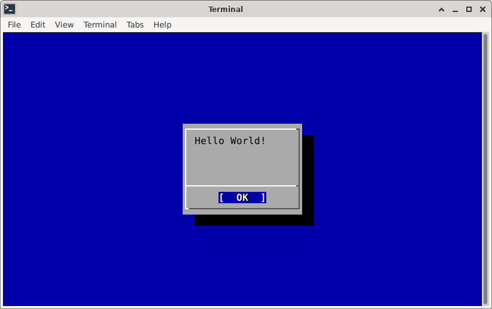

# BSDDialog

The **bsddialog** utility build UI Windgets in a terminal; the interface is
inspired by the **dialog** project (https://invisible-island.net/dialog/),
however **bsddialog** is released under the terms of the *BSD-2-Clause License*,
see LICENSE.

**Getting Started**

```
% git clone https://gitlab.com/alfix/bsddialog.git
% cc bsddialog.c -o bsddialog -lncurses
% ./bsddialog --title BSD --msgbox "Hello World!" 6 24
```
Output:

  


|  Option                      | Status      | Note                            |
| ---------------------------- | ----------- | ------------------------------- |
| --ascii-lines                |             |                                 |
| --aspect *ratio*             |             |                                 |
| --backtitle *backtitle*      |             |                                 |
| --begin y x                  | In progress |                                 |
| --cancel-label *string*      |             |                                 |
| --clear                      |             |                                 |
| --colors                     |             |                                 |
| --column-separator *string*  |             |                                 |
| --cr-wrap                    |             |                                 |
| --create-rc *file*           |             |                                 |
| --date-format *format*       |             |                                 |
| --defaultno                  |             |                                 |
| --default-button *string*    |             |                                 |
| --default-item *string*      |             |                                 |
| --exit-label *string*        |             |                                 |
| --extra-button               |             |                                 |
| --extra-label *string*       |             |                                 |
| --help                       | In progress |                                 |
| --help-button                |             |                                 |
| --help-label *string*        |             |                                 |
| --help-status                |             |                                 |
| --help-tags                  |             |                                 |
| --hfile *filename*           |             |                                 |
| --hline *string*             |             |                                 |
| --ignore                     |             |                                 |
| --input-fd *fd*              |             |                                 |
| --insecure                   |             |                                 |
| --item-help                  |             |                                 |
| --keep-tite                  |             |                                 |
| --keep-window                |             |                                 |
| --last-key                   |             |                                 |
| --max-input *size*           |             |                                 |
| --no-cancel                  |             |                                 |
| --nocancel                   |             |                                 |
| --no-collapse                |             |                                 |
| --no-items                   |             |                                 |
| --no-kill                    |             |                                 |
| --no-label *string*          |             |                                 |
| --no-lines                   |             |                                 |
| --no-mouse                   |             |                                 |
| --no-nl-expand               |             |                                 |
| --no-ok                      |             |                                 |
| --nook                       |             |                                 |
| --no-shadow                  |             |                                 |
| --no-tags                    |             |                                 |
| --ok-label *string*          |             |                                 |
| --output-fd *fd*             |             |                                 |
| --separator *string*         |             |                                 |
| --output-separator *string*  |             |                                 |
| --print-maxsize              |             |                                 |
| --print-size                 |             |                                 |
| --print-version              | Completed   |                                 |
| --quoted                     |             |                                 |
| --scrollbar                  |             |                                 |
| --separate-output            |             |                                 |
| --separate-widget *string*   |             |                                 |
| --shadow                     |             |                                 |
| --single-quoted              |             |                                 |
| --size-err                   |             |                                 |
| --sleep *secs*               |             |                                 |
| --stderr                     |             |                                 |
| --stdout                     |             |                                 |
| --tab-correct                |             |                                 |
| --tab-len *n*                |             |                                 |
| --time-format *format*       |             |                                 |
| --timeout *secs*             |             |                                 |
| --title *title*              | In progress |                                 |
| --trace *filename*           |             |                                 |
| --trim                       |             |                                 |
| --version                    | In progress |                                 |
| --visit-items                |             |                                 |
| --yes-label *string*         |             |                                 |


| Windget      | Status      | Note                                            |
|------------- | ----------- | ----------------------------------------------- |
| buildlist    |             |                                                 |
| calendar     |             |                                                 |
| checklist    |             |                                                 |
| dselect      |             |                                                 |
| editbox      |             |                                                 |
| form         |             |                                                 |
| fselect      |             |                                                 |
| gauge        |             |                                                 |
| infobox      | In progress |                                                 |
| inputbox     |             |                                                 |
| inputmenu    |             |                                                 |
| menu         |             |                                                 |
| mixedform    |             |                                                 |
| mixedgauge   |             |                                                 |
| msgbox       | In progress |                                                 |
| passwordbox  |             |                                                 |
| passwordform |             |                                                 |
| pause        |             |                                                 |
| prgbox       |             |                                                 |
| programbox   |             |                                                 |
| progressbox  |             |                                                 |
| radiolist    |             |                                                 |
| rangebox     |             |                                                 |
| tailbox      |             |                                                 |
| tailboxbg    |             |                                                 |
| textbox      |             |                                                 |
| timebox      |             |                                                 |
| treeview     |             |                                                 |
| yesno        | In progress |                                                 |

